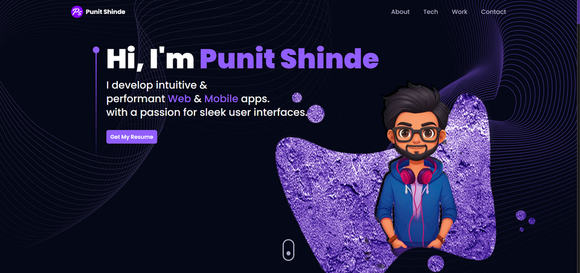
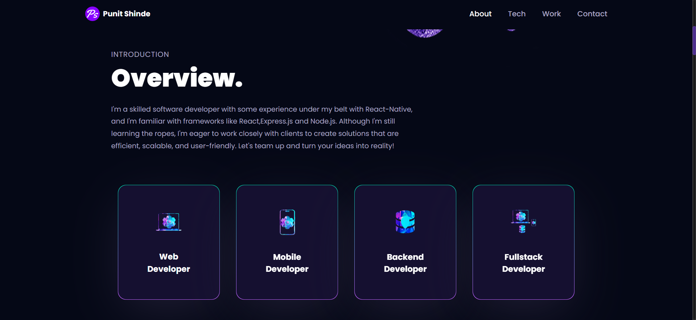
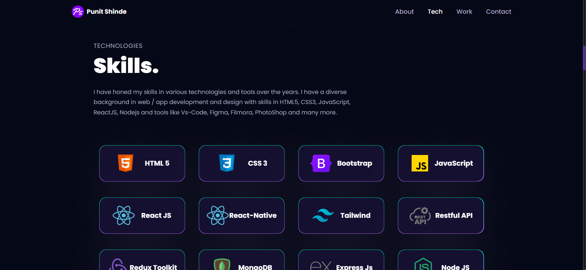
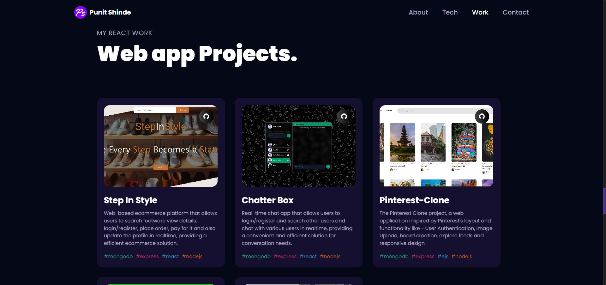
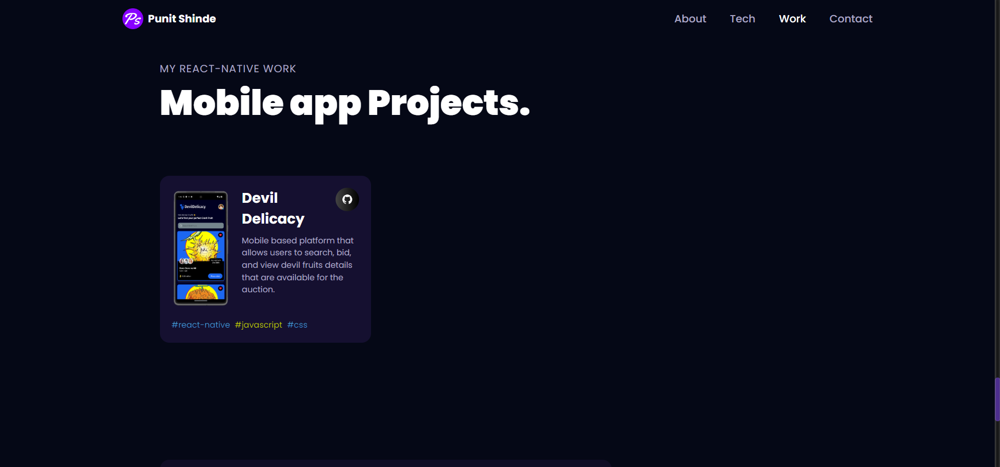

# Punit Shinde's Portfolio

Welcome to my portfolio! This portfolio showcases my work and projects developed using React with Vite, Motion Framer, and features various images and logos edited using Photoshop.

## Live Portfolio

You can view my portfolio live by clicking the button below:

## Technologies Used

- **React:** A JavaScript library for building user interfaces.
- **Vite:** A next-generation frontend tooling that provides instant server start.
- **Framer Motion:** A library for creating fluid animations and interactions in React.
- **Photoshop:** A graphic design and photo editing software developed by Adobe.

## Features

- **Responsive Design:** The portfolio is designed to be fully responsive, ensuring optimal viewing experience across devices.
- **Dynamic Animation:** Framer Motion is used to incorporate dynamic animations and interactions, enhancing user engagement.
- **Customized Images:** Various images and logos are edited using Photoshop to create a visually appealing and cohesive design.

## Screenshots

Here are some screenshots of my portfolio:

For full experience, You can view my portfolio live by clicking the button below:

## Contact Me

Feel free to reach out to me if you have any inquiries or would like to collaborate on a project:

- **Email:** [punitshinde1@gmail.com](mailto:your-email@example.com)
- **LinkedIn:** [https://www.linkedin.com/in/punit-shinde/](#)

## License

This portfolio is licensed under the [MIT License](LICENSE). Feel free to use, modify, and distribute the code as per the license terms.
